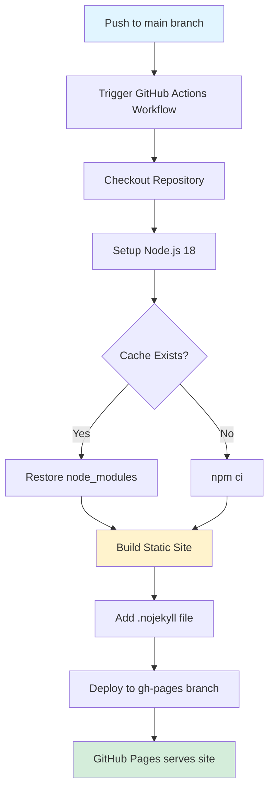

# Design Document: GitHub Pages Deployment

## Overview

This design implements an automated CI/CD pipeline using GitHub Actions to deploy a Nuxt 3 application to GitHub Pages. The solution leverages Nuxt's static site generation capabilities (`nuxt generate`) to pre-render all pages at build time, producing a fully static site that can be hosted on GitHub Pages without requiring a Node.js server.

The workflow will be triggered automatically on pushes to the main branch, ensuring the deployed site stays synchronized with the latest code. It includes dependency caching for faster builds, proper base path configuration for GitHub Pages repository hosting, and secure deployment using GitHub's built-in authentication.

Key design decisions:
- Use `nuxt generate` for static site generation (SSG) rather than server-side rendering
- Configure Nuxt with a base path matching the repository name for proper asset loading
- Use `peaceiris/actions-gh-pages` action for reliable GitHub Pages deployment
- Cache `node_modules` based on `package-lock.json` hash to optimize build times
- Deploy to a separate `gh-pages` branch to keep deployment artifacts separate from source code

## Architecture

### Workflow Architecture



### Deployment Flow

1. **Trigger Phase**: Workflow activates on push to main or manual dispatch
2. **Setup Phase**: Checkout code, install Node.js, restore or install dependencies
3. **Build Phase**: Run `nuxt generate` to create static site in `.output/public`
4. **Prepare Phase**: Add `.nojekyll` file to prevent Jekyll processing
5. **Deploy Phase**: Push build artifacts to `gh-pages` branch
6. **Serve Phase**: GitHub Pages automatically serves from `gh-pages` branch

### File Structure

```
.github/
  workflows/
    deploy.yml          # Main workflow configuration

.output/
  public/               # Generated static site (gitignored)
    _nuxt/              # Nuxt assets
    index.html          # Pre-rendered pages
    .nojekyll           # Prevents Jekyll processing

nuxt.config.ts          # Updated with base path configuration
```

## Components and Interfaces

### 1. GitHub Actions Workflow File

**Location**: `.github/workflows/deploy.yml`

**Purpose**: Defines the automated CI/CD pipeline for building and deploying the application.

**Structure**:

```yaml
name: Deploy to GitHub Pages

on:
  push:
    branches: [main]
  pull_request:
    branches: [main]
  workflow_dispatch:

permissions:
  contents: write
  pages: write

jobs:
  build-and-deploy:
    runs-on: ubuntu-latest
    
    steps:
      - name: Checkout
      - name: Setup Node.js
      - name: Cache dependencies
      - name: Install dependencies
      - name: Build static site
      - name: Add .nojekyll
      - name: Deploy to GitHub Pages
```

**Key Configuration**:
- **Triggers**: `push` to main, `pull_request` to main, manual `workflow_dispatch`
- **Permissions**: `contents: write` for pushing to gh-pages, `pages: write` for GitHub Pages
- **Runner**: `ubuntu-latest` for consistent Linux environment
- **Concurrency**: Not specified (allows parallel runs, queues if needed)

### 2. Checkout Step

**Action**: `actions/checkout@v4`

**Purpose**: Clones the repository code into the workflow runner.

**Configuration**:
```yaml
- name: Checkout repository
  uses: actions/checkout@v4
```

**Behavior**:
- Checks out the commit that triggered the workflow
- Includes full git history (default behavior)
- Sets up git credentials for subsequent operations

### 3. Node.js Setup Step

**Action**: `actions/setup-node@v4`

**Purpose**: Installs Node.js runtime and configures npm.

**Configuration**:
```yaml
- name: Setup Node.js
  uses: actions/setup-node@v4
  with:
    node-version: '18'
    cache: 'npm'
```

**Behavior**:
- Installs Node.js version 18 (LTS)
- Automatically caches npm dependencies based on `package-lock.json`
- Configures PATH to use installed Node.js and npm
- Verifies installation by running `node --version`

**Rationale for Node 18**:
- Nuxt 3 requires Node.js 16.10.0 or higher
- Node 18 is the current LTS version with long-term support
- Provides modern JavaScript features and performance improvements

### 4. Dependency Installation Step

**Command**: `npm ci`

**Purpose**: Installs project dependencies in a clean, reproducible manner.

**Configuration**:
```yaml
- name: Install dependencies
  run: npm ci
```

**Behavior**:
- Removes existing `node_modules` directory
- Installs exact versions from `package-lock.json`
- Fails if `package-lock.json` is out of sync with `package.json`
- Faster and more reliable than `npm install` for CI environments

**Cache Strategy**:
- The `actions/setup-node@v4` action with `cache: 'npm'` automatically handles caching
- Cache key is based on hash of `package-lock.json`
- Cache is stored in GitHub's cache storage (up to 10GB per repository)
- Subsequent runs restore cache if `package-lock.json` hasn't changed

### 5. Build Step

**Command**: `npm run generate`

**Purpose**: Generates static site using Nuxt's SSG capabilities.

**Configuration**:
```yaml
- name: Generate static site
  run: npm run generate
```

**Behavior**:
- Executes `nuxt generate` command defined in `package.json`
- Pre-renders all pages to static HTML
- Outputs to `.output/public` directory
- Includes all assets (CSS, JS, images) with hashed filenames
- Generates a `200.html` fallback for SPA mode (if configured)

**Build Output**:
- `.output/public/index.html` - Pre-rendered home page
- `.output/public/_nuxt/` - Bundled JavaScript and CSS with content hashes
- `.output/public/` - Any files from the `public/` directory
- All routes are pre-rendered as static HTML files

### 6. .nojekyll File Creation

**Purpose**: Prevents GitHub Pages from processing the site with Jekyll.

**Configuration**:
```yaml
- name: Add .nojekyll file
  run: touch .output/public/.nojekyll
```

**Behavior**:
- Creates an empty `.nojekyll` file in the build output
- Signals to GitHub Pages to skip Jekyll processing
- Allows files/directories starting with underscore (like `_nuxt/`)
- Ensures faster deployment (no Jekyll build step)

**Why This Is Necessary**:
- By default, GitHub Pages runs Jekyll on all content
- Jekyll ignores files/directories starting with underscore
- Nuxt generates assets in `_nuxt/` directory
- Without `.nojekyll`, these assets would be excluded, breaking the site

### 7. Deployment Step

**Action**: `peaceiris/actions-gh-pages@v3`

**Purpose**: Deploys build artifacts to GitHub Pages.

**Configuration**:
```yaml
- name: Deploy to GitHub Pages
  uses: peaceiris/actions-gh-pages@v3
  if: github.ref == 'refs/heads/main'
  with:
    github_token: ${{ secrets.GITHUB_TOKEN }}
    publish_dir: .output/public
    publish_branch: gh-pages
```

**Behavior**:
- Only runs on pushes to main branch (skipped for PRs)
- Uses built-in `GITHUB_TOKEN` for authentication
- Pushes contents of `.output/public` to `gh-pages` branch
- Creates `gh-pages` branch if it doesn't exist
- Force-pushes to `gh-pages` (replaces previous deployment)
- Adds commit message with deployment timestamp

**Alternative Action**:
- Could use `actions/deploy-pages@v2` (GitHub's official action)
- Requires additional setup with `actions/upload-pages-artifact`
- `peaceiris/actions-gh-pages` is simpler and widely adopted

### 8. Nuxt Configuration Updates

**File**: `nuxt.config.ts`

**Purpose**: Configure Nuxt for GitHub Pages deployment with proper base path.

**Required Changes**:

```typescript
export default defineNuxtConfig({
  // ... existing config
  
  app: {
    baseURL: process.env.NODE_ENV === 'production' 
      ? '/repository-name/' 
      : '/',
    buildAssetsDir: '_nuxt/',
    head: {
      // ... existing head config
    },
  },
  
  // Ensure static target for SSG
  ssr: false,
  
  // ... rest of config
})
```

**Configuration Explanation**:

- **`baseURL`**: Sets the base path for the application
  - In production (GitHub Pages): `/repository-name/`
  - In development: `/` (root)
  - Must match the GitHub repository name
  - Affects router base and asset paths

- **`buildAssetsDir`**: Directory for built assets (default: `_nuxt/`)
  - Keep as `_nuxt/` for consistency
  - Works with `.nojekyll` file

- **`ssr: false`**: Disables server-side rendering
  - Generates a pure static site (SPA mode)
  - All pages are pre-rendered at build time
  - No Node.js server required

**Environment Variable Approach**:

For flexibility, use an environment variable:

```typescript
app: {
  baseURL: process.env.NUXT_APP_BASE_URL || '/',
}
```

Then set in workflow:
```yaml
- name: Generate static site
  run: npm run generate
  env:
    NUXT_APP_BASE_URL: /repository-name/
```

## Data Models

### Workflow Configuration Schema

```yaml
# Workflow metadata
name: string                    # Display name in GitHub Actions UI
run-name: string (optional)     # Dynamic run name with expressions

# Trigger configuration
on:
  push:
    branches: string[]          # Branches that trigger on push
  pull_request:
    branches: string[]          # Branches that trigger on PR
  workflow_dispatch: {}         # Enable manual triggering

# Security configuration
permissions:
  contents: string              # read | write
  pages: string                 # read | write
  id-token: string (optional)   # write (for OIDC)

# Job definitions
jobs:
  [job-id]:
    runs-on: string             # Runner environment
    steps:
      - name: string            # Step display name
        uses: string (optional) # Action to use
        with: object (optional) # Action inputs
        run: string (optional)  # Shell command
        env: object (optional)  # Environment variables
        if: string (optional)   # Conditional execution
```

### Build Artifact Structure

```
.output/public/
├── index.html                  # Pre-rendered home page
├── .nojekyll                   # Jekyll bypass file
├── _nuxt/
│   ├── [hash].js              # Application JavaScript bundles
│   ├── [hash].css             # Compiled stylesheets
│   └── entry.[hash].js        # Main entry point
├── favicon.ico                 # From public/ directory
├── pokeball.png               # From public/ directory
└── robots.txt                 # From public/ directory
```

### GitHub Pages Configuration

**Repository Settings** (configured via GitHub UI or API):
```json
{
  "source": {
    "branch": "gh-pages",
    "path": "/"
  },
  "custom_domain": null,
  "https_enforced": true
}
```

**Deployment URL Pattern**:
- Format: `https://[username].github.io/[repository-name]/`
- Example: `https://johndoe.github.io/pokemon-tcg-app/`

## Correctness Properties


*A property is a characteristic or behavior that should hold true across all valid executions of a system—essentially, a formal statement about what the system should do. Properties serve as the bridge between human-readable specifications and machine-verifiable correctness guarantees.*

### Property 1: Workflow YAML Structure Validity

*For any* workflow file at `.github/workflows/deploy.yml`, the YAML structure should be valid according to GitHub Actions schema, include a job with a descriptive name, specify `ubuntu-latest` as the runner, and contain all necessary steps (checkout, Node.js setup, dependency installation, build, .nojekyll creation, and deployment).

**Validates: Requirements 1.1, 1.2, 1.3, 1.4, 1.5**

### Property 2: Workflow Trigger Configuration

*For any* workflow configuration, the trigger section should include push events for the main branch, pull_request events for the main branch, workflow_dispatch for manual triggering, and should not include triggers for other branches.

**Validates: Requirements 2.1, 2.2, 2.3, 2.4**

### Property 3: Node.js Environment Setup

*For any* workflow file, the Node.js setup step should use the `actions/setup-node@v4` action and specify Node.js version 18 or higher.

**Validates: Requirements 3.1, 3.2**

### Property 4: Dependency Caching Configuration

*For any* workflow file, the Node.js setup step should include cache configuration set to 'npm', and a separate step should run `npm ci` for dependency installation.

**Validates: Requirements 4.1, 4.4**

### Property 5: Nuxt Configuration for Static Generation

*For any* `nuxt.config.ts` file, the configuration should include an `app.baseURL` setting that matches the repository path pattern, and should set `ssr: false` to enable static site generation mode.

**Validates: Requirements 5.1, 5.2, 5.3**

### Property 6: Build Output Asset Paths

*For any* generated static site, all asset references in HTML files should include the configured base path prefix, ensuring assets load correctly when deployed to a subdirectory.

**Validates: Requirements 5.4**

### Property 7: Static Site Generation Command

*For any* workflow file, the build step should execute `npm run generate` command to trigger Nuxt's static site generation.

**Validates: Requirements 6.1**

### Property 8: Build Artifact Completeness

*For any* successful build execution, the `.output/public` directory should exist, contain HTML files, CSS files in the `_nuxt` directory, JavaScript files in the `_nuxt` directory, asset files from the `public` directory, and a `.nojekyll` file.

**Validates: Requirements 6.2, 6.4, 6.5, 6.6, 10.1, 10.3**

### Property 9: Deployment Action Configuration

*For any* workflow file, the deployment step should use an official GitHub Pages deployment action (such as `peaceiris/actions-gh-pages@v3`), specify `.output/public` as the publish directory, target the `gh-pages` branch, and use `secrets.GITHUB_TOKEN` for authentication.

**Validates: Requirements 7.1, 7.2, 7.5**

### Property 10: Workflow Security Configuration

*For any* workflow file, the permissions block should only include `contents: write` and `pages: write`, the deployment step should use `secrets.GITHUB_TOKEN` (not a custom PAT), and no run commands should echo or expose secret values.

**Validates: Requirements 8.1, 8.2, 8.3**

### Property 11: Step Naming Convention

*For any* workflow file, all steps should have a `name` field with descriptive text that clearly indicates the step's purpose (e.g., "Install dependencies", "Generate static site", "Deploy to GitHub Pages").

**Validates: Requirements 9.4**

## Error Handling

### Build Failures

**Scenario**: `npm run generate` fails due to compilation errors, missing dependencies, or runtime errors.

**Handling**:
- GitHub Actions automatically fails the workflow when any step returns a non-zero exit code
- Error output from Nuxt is captured in workflow logs
- Workflow status is marked as failed, preventing deployment
- Developers receive notification via GitHub (email, web, or mobile app)

**Prevention**:
- Run `npm run generate` locally before pushing
- Use pull request checks to catch build failures before merging
- Add a separate CI workflow that runs on all branches for early detection

### Deployment Failures

**Scenario**: Deployment action fails due to permission issues, network errors, or invalid configuration.

**Handling**:
- Deployment step includes `if: github.ref == 'refs/heads/main'` to only run on main branch
- If deployment fails, workflow is marked as failed
- Previous deployment remains live (no partial updates)
- Error logs indicate the specific failure reason

**Common Causes**:
- Insufficient permissions: Ensure `contents: write` permission is granted
- Branch protection: Ensure `gh-pages` branch allows force pushes
- Token expiration: `GITHUB_TOKEN` is automatically refreshed per workflow run

### Configuration Errors

**Scenario**: Incorrect base path in `nuxt.config.ts` causes broken asset links.

**Handling**:
- Use environment variables to configure base path dynamically
- Document the required base path format in README
- Test locally using `npm run preview` with base path configured

**Example**:
```typescript
// Use environment variable with fallback
app: {
  baseURL: process.env.NUXT_APP_BASE_URL || '/',
}
```

### Cache Corruption

**Scenario**: Cached dependencies are corrupted or incompatible.

**Handling**:
- `npm ci` removes existing `node_modules` before installing
- Cache is automatically invalidated when `package-lock.json` changes
- Manual cache clearing available via GitHub Actions UI (Settings → Actions → Caches)

**Recovery**:
- Delete cache from repository settings
- Re-run workflow to rebuild cache from scratch

### Missing .nojekyll File

**Scenario**: `.nojekyll` file is not created, causing GitHub Pages to ignore `_nuxt` directory.

**Handling**:
- Explicit step in workflow creates the file: `touch .output/public/.nojekyll`
- Step runs after build but before deployment
- If step fails, workflow fails and deployment is prevented

**Verification**:
- Add optional verification step: `test -f .output/public/.nojekyll`
- Check deployed site for presence of `_nuxt` assets

## Testing Strategy

### Unit Tests

Unit tests focus on validating the configuration files and build outputs for specific scenarios and edge cases.

**Test Categories**:

1. **Workflow YAML Validation**
   - Parse `.github/workflows/deploy.yml` and validate against GitHub Actions schema
   - Verify specific configuration values (Node version, runner OS, branch names)
   - Check that required steps exist in the correct order
   - Validate conditional expressions (e.g., `if: github.ref == 'refs/heads/main'`)

2. **Nuxt Configuration Validation**
   - Parse `nuxt.config.ts` and verify base URL configuration
   - Check that `ssr: false` is set for static generation
   - Validate that build assets directory is configured correctly

3. **Build Output Validation**
   - Run `npm run generate` in a test environment
   - Verify `.output/public` directory exists and contains expected files
   - Check for presence of `.nojekyll` file
   - Validate that HTML files contain correct base path in asset references

4. **Security Validation**
   - Scan workflow file for hardcoded secrets or tokens
   - Verify that only `secrets.GITHUB_TOKEN` is used
   - Check that permissions are minimal (only `contents: write` and `pages: write`)

**Example Unit Test (Pseudocode)**:
```javascript
describe('Workflow Configuration', () => {
  test('should use Node.js version 18', () => {
    const workflow = parseYAML('.github/workflows/deploy.yml');
    const setupNodeStep = workflow.jobs['build-and-deploy'].steps
      .find(step => step.uses?.startsWith('actions/setup-node'));
    expect(setupNodeStep.with['node-version']).toBe('18');
  });

  test('should include .nojekyll file in build output', () => {
    execSync('npm run generate');
    const nojekyllExists = fs.existsSync('.output/public/.nojekyll');
    expect(nojekyllExists).toBe(true);
  });
});
```

### Property-Based Tests

Property-based tests validate universal properties across many generated inputs, ensuring the configuration works correctly for different scenarios.

**Test Configuration**:
- Minimum 100 iterations per property test
- Each test references its design document property
- Tag format: **Feature: github-pages-deployment, Property {number}: {property_text}**

**Property Test Categories**:

1. **Workflow Structure Properties**
   - Generate variations of workflow files with different step orders
   - Verify that required steps are always present regardless of order
   - Test that trigger configurations correctly filter events

2. **Build Output Properties**
   - Generate different Nuxt applications with varying page structures
   - Verify that all generated HTML files include correct base path
   - Test that asset references are always prefixed correctly

3. **Configuration Properties**
   - Generate different base path values (various repository names)
   - Verify that Nuxt config correctly applies base path to all routes
   - Test that build output matches configured base path

**Example Property Test (Pseudocode)**:
```javascript
describe('Property: Build Output Asset Paths', () => {
  test('all asset references include base path', () => {
    // Feature: github-pages-deployment, Property 6: Build Output Asset Paths
    
    forAll(arbitraryBasePath(), (basePath) => {
      // Configure Nuxt with base path
      updateNuxtConfig({ app: { baseURL: basePath } });
      
      // Generate static site
      execSync('npm run generate');
      
      // Read all HTML files
      const htmlFiles = glob('.output/public/**/*.html');
      
      // Verify all asset references include base path
      return htmlFiles.every(file => {
        const content = fs.readFileSync(file, 'utf-8');
        const assetRefs = extractAssetReferences(content);
        return assetRefs.every(ref => ref.startsWith(basePath));
      });
    });
  });
});
```

**Property Test Benefits**:
- Catches edge cases with unusual repository names (special characters, long names)
- Verifies configuration works across different project structures
- Ensures robustness against future changes to Nuxt or GitHub Actions

### Integration Tests

Integration tests validate the end-to-end workflow execution in a realistic environment.

**Test Approach**:
- Use GitHub's `act` tool to run workflows locally
- Create a test repository with the workflow configuration
- Trigger workflow and verify successful completion
- Check that `gh-pages` branch is created with correct content

**Test Scenarios**:
1. First-time deployment (no existing `gh-pages` branch)
2. Subsequent deployment (updating existing `gh-pages` branch)
3. Pull request build (should build but not deploy)
4. Manual workflow dispatch

**Example Integration Test**:
```bash
# Run workflow locally using act
act push -j build-and-deploy

# Verify gh-pages branch was created
git checkout gh-pages
test -f index.html
test -f .nojekyll
test -d _nuxt

# Verify asset paths are correct
grep -q 'src="/repository-name/_nuxt/' index.html
```

### Manual Testing Checklist

Before considering the feature complete, manually verify:

- [ ] Workflow appears in GitHub Actions UI
- [ ] Workflow triggers on push to main
- [ ] Workflow runs successfully without errors
- [ ] `gh-pages` branch is created/updated
- [ ] GitHub Pages settings show `gh-pages` as source
- [ ] Deployed site loads correctly at `https://[username].github.io/[repo]/`
- [ ] All assets (CSS, JS, images) load without 404 errors
- [ ] Navigation works correctly with base path
- [ ] Browser console shows no errors

### Continuous Validation

**Ongoing Checks**:
- Monitor workflow execution times (should be < 5 minutes)
- Track workflow success rate (should be > 95%)
- Review failed workflow logs for patterns
- Update Node.js version as new LTS releases become available
- Keep GitHub Actions up to date (dependabot for workflow actions)
